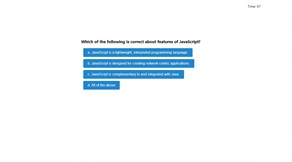

# Code Quiz Challenge project.

This project has been developed to represent the use of the DOM API (Document Object Model) in a practical application of an exam with multiple choice questions and answers. https://jamaya273.github.io/CodeQuiz/
The DOM represents a web application in the form of a tree, where each branch ends in a node that can contain both objects and event handlers.
This is also a practical example to demonstrate the use of event delegation, which allows us to add event listeners that can be propagated by elements that share the same selector.
 

## How to use the application

Clicking the ‘Start Quiz’ button starts a new test and the timer initially set for 100 seconds starts the countdown. In a separate option, the "Show high scores" button allows us to display the scores that have been previously recorded.

Once the test begins, the first question is shown and the answer is awaited, at this moment the timer is already running, if the user answers correctly, the next question is presented, if the answer is incorrect then the timer penalizes with 10 seconds. Follow the same procedures until the last question. The test ends once all questions have been answered or the timer is set to 0.

After the test is complete, the final score is presented to the user, the score is the exact second the test was completed. Then the user can register her/his initials in the input field once she/he clicks the "Submit" button.

Now, the initials and previous scores recorded are presented. At this point two buttons are activated: the "Go Back" button that would reload the page to start over, the "Clear high scores" button that will delete the previous scores recorded in the local storage of this application, then will return to the starting position of the quiz once more.

---

## Summary

The design of this application could be challenging because the program must maintain its flow by presenting one screen after another. This is possible thanks to the methods used by JavaScript. The code in the program could get disorganized, but I think that with more practice it will be possible to get cleaner and easier to understand code. Also, in this project we learned about local storage and timers; both are useful for designing better user interfaces in real world applications.

